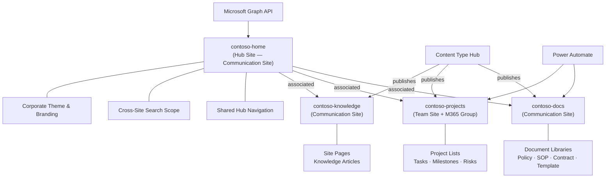

# Contoso Intranet Hub

Production-grade corporate intranet built on **SharePoint Online**, demonstrating hub site architecture, modern SPFx development, provisioning-as-code, document lifecycle management, and enterprise governance. Designed as a portfolio reference for senior Microsoft 365 consulting engagements.

---

## Architecture Overview



## Tech Stack

| Layer | Technology | Purpose |
|---|---|---|
| Platform | SharePoint Online (E3/E5) | Hub site, document management, search |
| Front End | SPFx 1.22 (React 18 + Fluent UI v9) | Web parts, extensions, ACEs |
| Provisioning | PnP PowerShell 2.x | Infrastructure-as-code deployment |
| Automation | Power Automate | Document approval, notifications |
| API | Microsoft Graph v1.0 | User profiles, presence, Teams integration |
| Taxonomy | Managed Metadata Service | Enterprise term sets, content type hub |
| Governance | Purview Compliance Center | Retention labels, DLP policies |

## Features

### Hub Site Architecture
- Central hub site with three associated sites (Documents, Projects, Knowledge Base)
- Shared navigation, search scope, and corporate branding across all sites
- Content type publishing from Content Type Hub to all associated sites

### SPFx Components (10 total)
| # | Type | Component | Description |
|---|---|---|---|
| 1 | Web Part | Mega Menu Navigation | List-backed multi-level navigation with Fluent UI |
| 2 | Web Part | Company Announcements | Targeted announcements with priority and expiry |
| 3 | Web Part | Enterprise Search | Cross-site search with managed property filters |
| 4 | Web Part | Project Dashboard | Aggregated project status from M365 Group site |
| 5 | Extension | Hub Header | Custom global header with notifications and quick links |
| 6 | Extension | Footer | Corporate footer with legal links and support contact |
| 7 | Extension | Analytics Tracker | Application customizer for page view telemetry |
| 8 | ACE | My Tasks | Viva Connections card showing user's assigned tasks |
| 9 | ACE | Company News | Viva Connections card for latest announcements |
| 10 | Command Set | Document Actions | List view command for bulk metadata tagging |

### Provisioning-as-Code
- Fully scripted deployment: sites, taxonomy, content types, navigation, permissions
- Idempotent scripts safe for re-execution
- Sample data seeding for demonstrations

### Document Lifecycle
- Managed metadata classification (Department, Classification, Process Area)
- Content type hierarchy with inherited columns
- Retention policies aligned to document type
- DLP policies for Confidential/Restricted content

### Governance
- Permissions matrix across all sites and roles
- Retention schedule per document category
- DLP policy definitions (E5 feature documentation)
- ISO 27001 / SOC 2 compliance mapping

## Project Structure

```
contoso-intranet-hub/
├── README.md
├── .gitignore
├── docs/
│   ├── architecture.md
│   ├── information-architecture.md
│   └── decisions/
│       ├── 001-hub-site-over-flat-topology.md
│       ├── 002-content-type-hub-over-local-types.md
│       ├── 003-pnp-provisioning-over-manual.md
│       ├── 004-list-backed-nav-over-hardcoded.md
│       └── 005-spfx-search-over-pnp-search.md
├── provisioning/
│   ├── scripts/
│   │   ├── Deploy-IntranetHub.ps1          # Master orchestrator
│   │   ├── New-HubSiteTopology.ps1         # Sites + hub registration
│   │   ├── Deploy-Taxonomy.ps1             # Term store setup
│   │   ├── Deploy-ContentTypes.ps1         # Content types + site columns
│   │   ├── Deploy-Theme.ps1                # Corporate theme
│   │   ├── Deploy-SiteDesigns.ps1          # Site designs + scripts
│   │   ├── Deploy-Navigation.ps1           # Hub nav + mega menu list
│   │   ├── Set-Permissions.ps1             # Groups + permission levels
│   │   └── Import-SampleData.ps1           # Seed demo content
│   ├── sample-data/
│   │   ├── announcements.csv
│   │   ├── projects.csv
│   │   └── navigation-nodes.csv
│   └── templates/
│       ├── contoso-theme.json
│       └── site-scripts/
│           └── project-site-script.json
├── governance/
│   ├── permissions-matrix.md
│   ├── retention-schedule.md
│   ├── dlp-policy-definitions.md
│   └── compliance-checklist.md
└── spfx/                                   # (Phase 2+)
    ├── web-parts/
    ├── extensions/
    └── aces/
```

## Build Phases

| Phase | Scope | Status |
|---|---|---|
| **Phase 1** | Foundation: docs, architecture, provisioning scripts, governance | In Progress |
| **Phase 2** | SPFx web parts: Mega Menu, Announcements, Search, Dashboard | Not Started |
| **Phase 3** | SPFx extensions: Header, Footer, Analytics Tracker | Not Started |
| **Phase 4** | ACEs: My Tasks, Company News | Not Started |
| **Phase 5** | Command Set: Document Actions | Not Started |
| **Phase 6** | Power Automate flows: document approval, notifications | Not Started |
| **Phase 7** | Testing, CI/CD pipeline, production hardening | Not Started |

## Getting Started

### Prerequisites

- SharePoint Online tenant (Microsoft 365 E3 or E5)
- [PnP PowerShell](https://pnp.github.io/powershell/) 2.x or later
- [Node.js](https://nodejs.org/) 18.x LTS (for SPFx development in Phase 2+)
- SharePoint Administrator or Global Administrator role
- PowerShell 7.x

### Quick Start

1. **Clone the repository**
   ```bash
   git clone https://github.com/contoso/contoso-intranet-hub.git
   cd contoso-intranet-hub
   ```

2. **Install PnP PowerShell** (if not already installed)
   ```powershell
   Install-Module -Name PnP.PowerShell -Scope CurrentUser
   ```

3. **Run the master deployment script**
   ```powershell
   .\provisioning\scripts\Deploy-IntranetHub.ps1 `
       -TenantUrl "https://contoso.sharepoint.com" `
       -AdminEmail "admin@contoso.onmicrosoft.com"
   ```

   The orchestrator will execute all provisioning steps in order:
   - Create hub site topology (4 sites)
   - Deploy managed metadata taxonomy
   - Create and publish content types
   - Apply corporate theme
   - Register site designs
   - Configure hub navigation
   - Set permissions and groups
   - Import sample data

4. **Verify deployment** by navigating to `https://contoso.sharepoint.com/sites/contoso-home`

### Running Individual Scripts

Each provisioning script can be run independently after connecting to SharePoint:

```powershell
Connect-PnPOnline -Url "https://contoso-admin.sharepoint.com" -Interactive

# Example: deploy only taxonomy
.\provisioning\scripts\Deploy-Taxonomy.ps1 -TenantUrl "https://contoso.sharepoint.com"
```

## License

This project is provided as a portfolio demonstration. All company names and sample data are fictitious.
