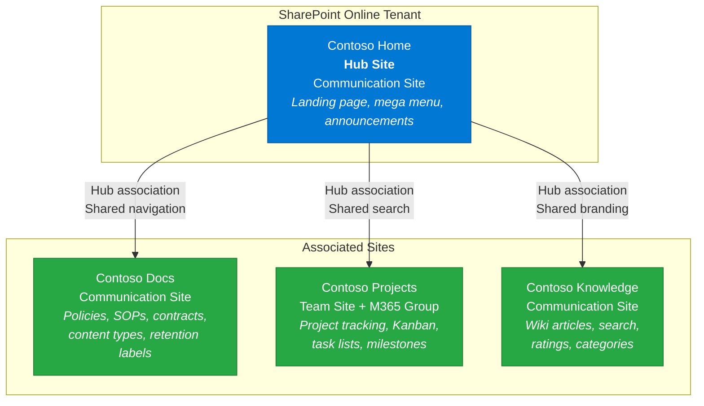
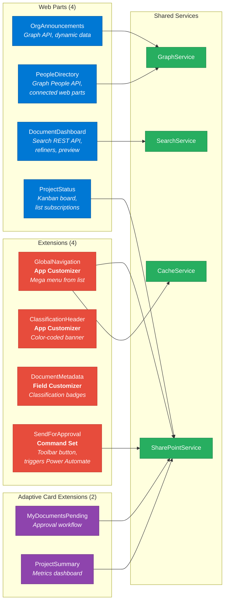
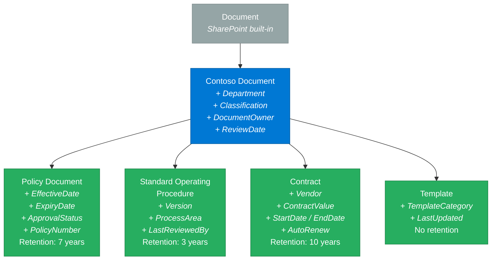
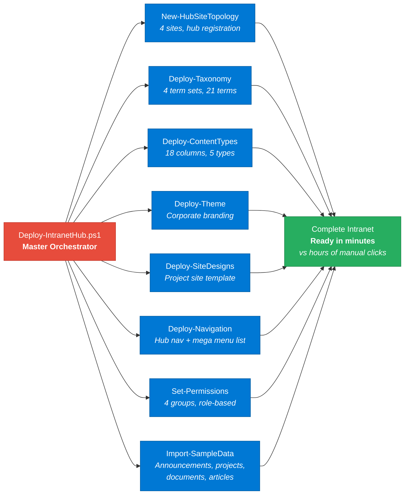

# Contoso Intranet Hub — Architecture Diagrams

## Hub Site Topology



## SPFx Component Map



## Content Type Hierarchy



## Provisioning Pipeline



## Document Lifecycle

```mermaid
flowchart TB
    Upload["Document Uploaded<br/><i>Required metadata enforced</i>"]

    Upload --> Classify["Classification Assigned<br/><i>Public / Internal /<br/>Confidential / Restricted</i>"]

    Classify --> Review{"Needs Approval?"}

    Review -->|"Yes"| Approval["Send for Approval<br/><i>Command Set triggers<br/>Power Automate flow</i>"]
    Review -->|"No"| Published["Published<br/><i>Available in search,<br/>classification banner shows</i>"]

    Approval --> Approved{"Decision"}
    Approved -->|"Approved"| Published
    Approved -->|"Rejected"| Draft["Back to Draft<br/><i>Author notified</i>"]
    Draft --> Upload

    Published --> ReviewCycle["Review Cycle<br/><i>Weekly flow checks<br/>ReviewDate field</i>"]
    ReviewCycle -->|"Past due"| TaskCreated["Review Task Created<br/><i>Assigned to DocumentOwner</i>"]
    TaskCreated --> Upload

    Published --> Retention["Retention Policy<br/><i>Auto-applied by<br/>content type</i>"]
    Retention -->|"Expired"| Archive["Archived / Deleted<br/><i>Per retention schedule</i>"]

    classDef action fill:#0078D4,stroke:#005A9E,color:#fff
    classDef decision fill:#F39C12,stroke:#D68910,color:#fff
    classDef end fill:#27AE60,stroke:#1E8449,color:#fff

    class Upload,Classify,Approval,Draft,ReviewCycle,TaskCreated action
    class Review,Approved decision
    class Published,Retention,Archive end
```
